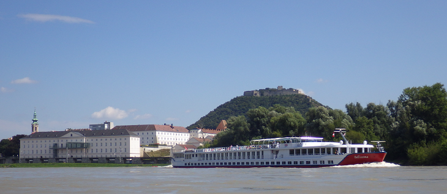
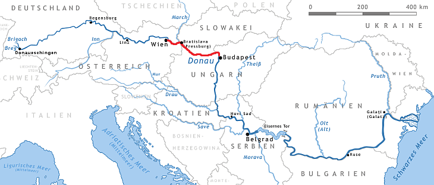
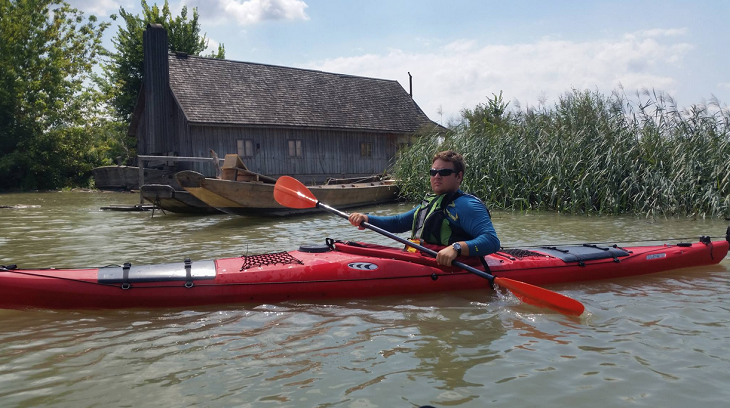

Na kayaku cez tri hlavné mestá - 1. Plánovanie
##############################################

:date: 2016-08-26
:tags: kayak
:category: kayak
:slug: 3town-planning
:authors: Patrik Skovajsa
:summary: Plán riečnej cesty z Viedne do Budapešti

Blíži sa koniec leta a v našich končinách sa naskytá posledná príležitosť na dobrodrúžstvo v prírode s pekným počasím cez deň a nie príliš studenými nocami. Rozhodol som sa zúročiť mesiace trénovania na vode s morským kayakom. Výber padol na najdlhšiu rieku v Európskej únii, druhú najdlhšiu rieku v Európe a 30. najdlhšiu rieku na svete. Netreba chodiť ďaleko, je to "náš" Dunaj. Na úseku asi 270km spája hlavné mestá troch susediacich krajín: **Viedeň**, **Bratislava** a **Budapešť**. Práve to bude naša cesta. 

Splav som naplánoval na 5 dní. Po Bratislavu tečie Dunaj ešte celkom rýchlo, takže prvý deň sa spotíme aj keby nevyšla veľmi dobrá predpoveď počasia a pokúsime sa prejsť až po Dobrohošť, kde prenesieme člny do starého koryta Dunaja, ktorý je oveľa krajší a okrem kompy tam neplávajú veľké lode, ktoré kazia pokojný spánok. Kúsok za prenáškou je veľký zalesnený ostrov, kde sú perfektné miesta na táborenie.

===== ========== ==============
Deň   Denný plán Prejdená trasa
===== ========== ==============
1.deň 70 km      70 km
2.deň 50 km      120 km
3.deň 50 km      170 km
4.deň 50 km      220 km
5.deň 56 km      **276 km**
===== ========== ==============

**Riečne kilometre**

================== =================
1.deň              km
================== =================
WIEN prístav       1916,8 - 1920,2
Orth an der Donau  1904,0
HAINBURG           1883,5
Devín              1880,26
BRATISLAVA prístav 1867,0
priehrada Čunovo   1852,0
Dobrohošť          1842,0 **(prenáška)** 
Ostrov **(tábor)** 1840,0
================== =================

========================= ======
2.deň                     km
========================= ======
Hullám csárda             1820,0
GABČÍKOVO plavebná komora 1819,0
sútok so starým Dunajom   1811,0
GYÖR-GÖNYU prístav        1807,0
Pláž **(tábor)**          ~1796
========================= ======

======================= ======
3.deň                   km
======================= ======
KOMÁRNO                 1767,1
KOMÁRNO most            1767,9
Čarda Moča **(tábor)**  ~1746
======================= ======

============================== ======
4.deň                          km
============================== ======
ŠTÚROVO prístav                1722,0
Ostrihomská katedrála          1718,0
rieka Ipeľ                     1708,2
LEPENCE – VISEGRAD **(tábor)** 1697,0
============================== ======

============================ =============
5.deň                        km
============================ =============
BUDAPEŠŤ prístav **(tábor)** 1657,0-1640,0
============================ =============
